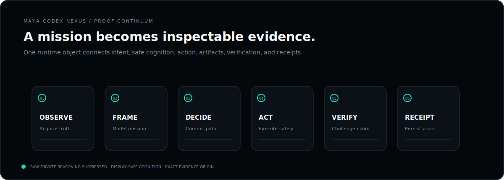
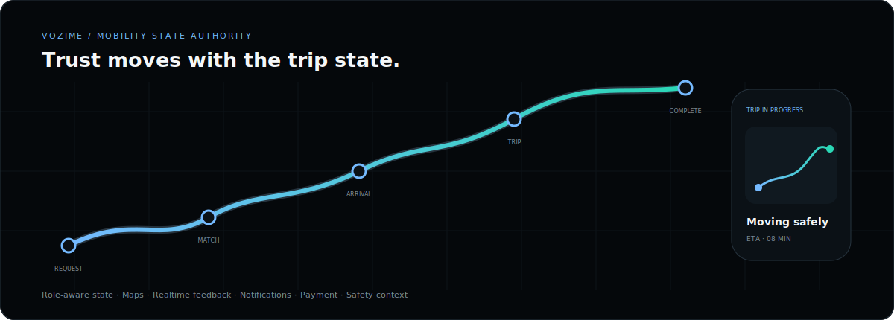
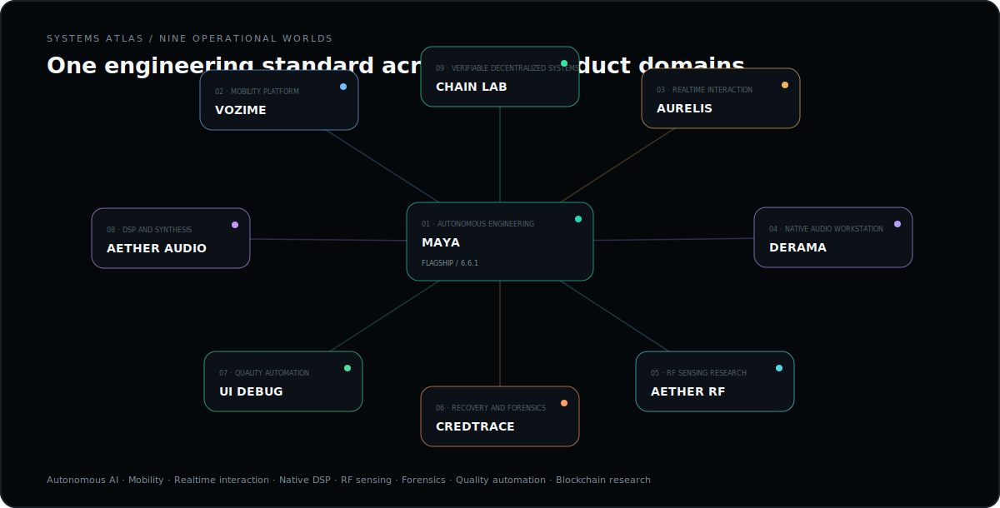
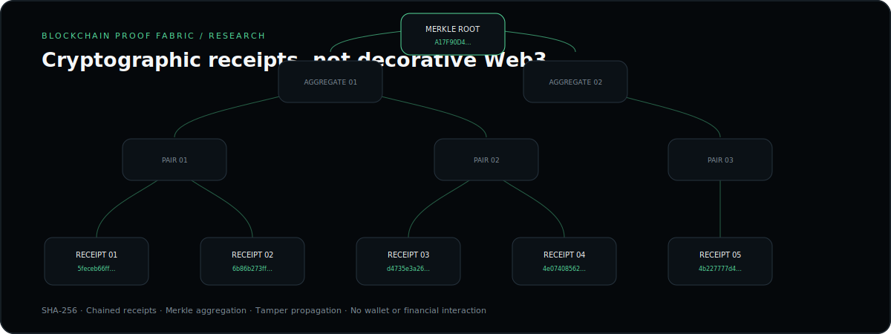
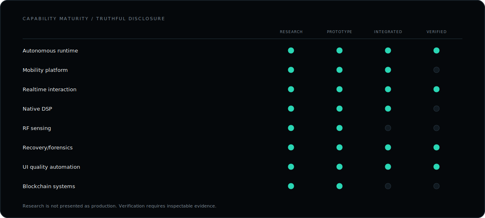

<picture>
  <source media="(prefers-color-scheme: dark)" srcset="./assets/apex/hero-dark.svg">
  <source media="(prefers-color-scheme: light)" srcset="./assets/apex/hero-light.svg">
  
</picture>

  <strong>Autonomous AI · Mobility · Blockchain · Native DSP · RF sensing · Proof architecture</strong>

  <a href="#maya-codex-nexus">MAYA</a>
  &nbsp;·&nbsp;
  <a href="#vozime">Vozime</a>
  &nbsp;·&nbsp;
  <a href="#systems-atlas">Systems Atlas</a>
  &nbsp;·&nbsp;
  <a href="#blockchain-proof-fabric">Blockchain</a>
  &nbsp;·&nbsp;
  <a href="https://gonzo-max2.github.io/gonzo-max2/">Enter Profile OS</a>

## Operating profile

I design systems where **intent, execution, artifacts, verification, and evidence remain one continuous object**.

<table>
<tr>
<td width="50%" valign="top">

### Current mission

**MAYA Codex Nexus 6.6.1**

Rust control-plane migration, verified autonomous execution, model orchestration, and proof-native desktop interaction.

</td>
<td width="50%" valign="top">

### Engineering invariants

- Runtime truth over simulated completion
- Typed contracts over implicit coupling
- Receipts over unsupported claims
- Graceful degradation over blank screens
- Measured performance over decorative motion
- Research labelled honestly

</td>
</tr>
</table>

## MAYA Codex Nexus

<picture>
  <source media="(prefers-color-scheme: dark)" srcset="./assets/apex/maya-dark.svg">
  <source media="(prefers-color-scheme: light)" srcset="./assets/apex/maya-light.svg">
  
</picture>

**MAYA** is a local-first autonomous engineering workstation built around a proof continuum:

> Instruction → Observe → Frame → Decide → Act → Verify → Receipt

The system binds workspace truth, tool execution, transactional edits, runtime failures, verification output, and final receipts into one inspectable causal chain.

<table>
<tr>
<td width="33%" valign="top">

### Runtime

Tauri desktop shell, Rust-native bridge, authenticated Python sidecar, SSE event transport, worktree isolation, persistent receipts, and deterministic recovery.

</td>
<td width="33%" valign="top">

### Intelligence

Local and remote model gateways, specialist agents, project memory, retrieval, safe cognition projection, and evidence-aware routing.

</td>
<td width="33%" valign="top">

### Interface

Mission timeline, Cognition Ribbon, Continuum Spine, contextual surfaces, autonomous tab routing, exact origin restoration, and graceful degradation.

</td>
</tr>
</table>

## Vozime

<picture>
  <source media="(prefers-color-scheme: dark)" srcset="./assets/apex/vozime-dark.svg">
  <source media="(prefers-color-scheme: light)" srcset="./assets/apex/vozime-light.svg">
  
</picture>

**Vozime** is a rider-and-driver mobility platform where request, matching, arrival, trip, payment, notification, and safety state advance through one deterministic lifecycle.

`React Native` `Expo` `TypeScript` `Maps` `Realtime state` `Mobile UX`

## Systems Atlas

<picture>
  <source media="(prefers-color-scheme: dark)" srcset="./assets/apex/systems-dark.svg">
  <source media="(prefers-color-scheme: light)" srcset="./assets/apex/systems-light.svg">
  
</picture>

<table>
<tr>
<td width="50%" valign="top">

### AURELIS

Deterministic realtime presentation architecture with velocity-driven motion, synchronized audio and haptics, pooled effects, and measured frame performance.

`TypeScript` `React` `Canvas` `Web Audio`

</td>
<td width="50%" valign="top">

### DERAMA Studio

Native audio-workstation architecture spanning playlist, channel rack, piano roll, mixer, automation, synthesis, sampling, and JUCE DSP.

`C++` `JUCE` `DSP` `Desktop audio`

</td>
</tr>
<tr>
<td width="50%" valign="top">

### AETHER RF Sense

Real-input-only Wi-Fi telemetry research with movement inference, resilient acquisition, calibration, confidence projection, and realtime signal visualization.

`Python` `Signal processing` `RF telemetry`

</td>
<td width="50%" valign="top">

### CredTrace

Bounded local recovery and forensic analysis with persistent evidence, resumable execution, archive inspection, and redacted exports.

`Python` `SQLite` `Forensics` `Local-first`

</td>
</tr>
<tr>
<td width="50%" valign="top">

### UI_DEBUG_MCP_PRO

Fail-closed UI quality automation for runtime exceptions, authentication failures, accessibility audits, network diagnostics, and machine-readable CI receipts.

`Playwright` `Accessibility` `CI` `Runtime diagnostics`

</td>
<td width="50%" valign="top">

### Aether Audio Lab

Native DSP and synthesis research spanning spatial reverb, modulation, advanced synthesis, realtime visualization, and instrument-grade controls.

`C++` `JUCE` `DSP` `Synthesis`

</td>
</tr>
</table>

## Blockchain Proof Fabric

<picture>
  <source media="(prefers-color-scheme: dark)" srcset="./assets/apex/ledger-dark.svg">
  <source media="(prefers-color-scheme: light)" srcset="./assets/apex/ledger-light.svg">
  
</picture>

The blockchain track is an explicitly labelled **research direction** focused on:

- SHA-256 execution receipts
- Chained event integrity
- Merkle proof aggregation
- Smart-contract safety boundaries
- Verifiable autonomous actions
- Zero-knowledge architecture
- Honest separation of on-chain and off-chain authority

The interactive Profile OS includes a browser-native tamper demonstration with no wallet, token, RPC endpoint, transaction signing, or financial interaction.

## Capability maturity

<picture>
  <source media="(prefers-color-scheme: dark)" srcset="./assets/apex/capabilities-dark.svg">
  <source media="(prefers-color-scheme: light)" srcset="./assets/apex/capabilities-light.svg">
  
</picture>

## Engineering activity

The activity panel is generated by this repository's own GitHub Actions workflow using GitHub's API. It does not depend on a third-party profile-stat renderer.

<picture>
  <source media="(prefers-color-scheme: dark)" srcset="./assets/activity-dark.svg">
  <source media="(prefers-color-scheme: light)" srcset="./assets/activity-light.svg">
  
</picture>

## Collaboration model

I work best on systems requiring architectural depth:

- Autonomous developer tooling
- Secure local AI infrastructure
- Mobility and dispatch platforms
- Blockchain verification and cryptographic receipt systems
- Native desktop and audio software
- RF telemetry and scientific interfaces
- Recovery, evidence, and verification tooling
- High-performance, accessibility-complete interaction systems

  <strong>Build locally. Verify everything. Ship with evidence.</strong>

