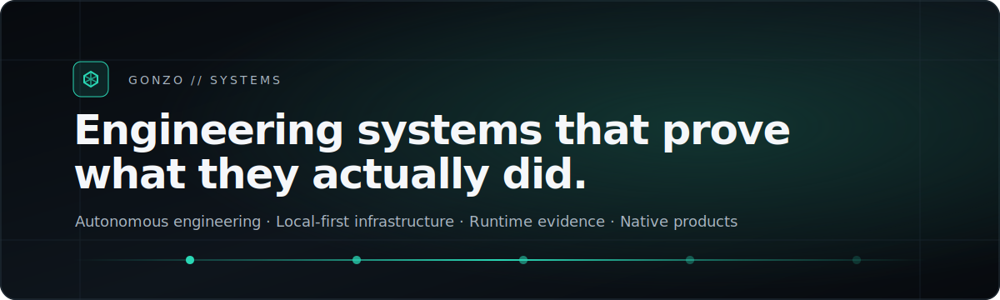
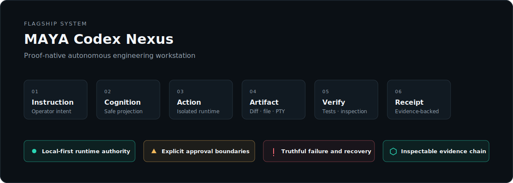
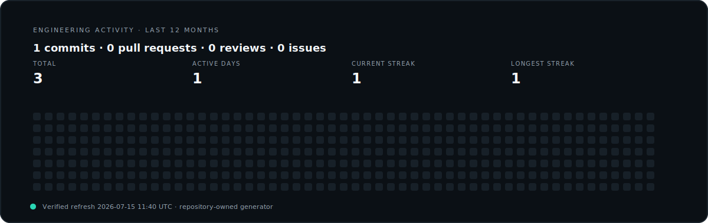

<picture>
  <source media="(prefers-color-scheme: dark)" srcset="./assets/hero-dark.svg">
  <source media="(prefers-color-scheme: light)" srcset="./assets/hero-light.svg">
  
</picture>

  <strong>Systems engineering · Autonomous AI · Local-first infrastructure · Real-time product architecture</strong>

  <a href="#maya-codex-nexus">MAYA</a>
  &nbsp;·&nbsp;
  <a href="#engineering-doctrine">Engineering doctrine</a>
  &nbsp;·&nbsp;
  <a href="#selected-systems">Selected systems</a>
  &nbsp;·&nbsp;
  <a href="#engineering-activity">Activity</a>

## Operating profile

I design and build systems where **reasoning, execution, verification, and evidence remain one continuous object**.

My work concentrates on autonomous development environments, local model orchestration, secure runtime boundaries, native desktop systems, real-time interfaces, recovery tooling, and production-grade interaction architecture.

<table>
<tr>
<td width="50%" valign="top">

### Current focus

- Proof-native autonomous engineering
- Local-first model and tool orchestration
- Deterministic agent runtimes
- Sandboxed command execution
- Event-sourced desktop applications
- High-density professional UI systems

</td>
<td width="50%" valign="top">

### Delivery standard

- Runtime truth over simulated completion
- Typed contracts over implicit coupling
- Receipts over unsupported claims
- Graceful degradation over blank screens
- Measured performance over decorative motion
- Complete systems over disconnected prototypes

</td>
</tr>
</table>

## MAYA Codex Nexus

<picture>
  <source media="(prefers-color-scheme: dark)" srcset="./assets/maya-system-dark.svg">
  <source media="(prefers-color-scheme: light)" srcset="./assets/maya-system-light.svg">
  
</picture>

**MAYA Codex Nexus** is a local-first autonomous engineering workstation built around an explicit execution continuum:

> Instruction → Observe → Frame → Decide → Act → Verify → Learn → Receipt

The system is designed to keep operator intent, tool activity, workspace changes, runtime failures, verification results, and final evidence causally connected.

<table>
<tr>
<td width="33%" valign="top">

### Runtime

Tauri desktop shell, Rust-native bridge, FastAPI sidecar, SSE event transport, transactional worktrees, persistent receipts, and deterministic recovery.

</td>
<td width="33%" valign="top">

### Intelligence

Local and remote inference gateways, model routing, specialist agents, project memory, retrieval, evidence projection, and safe cognition summaries.

</td>
<td width="33%" valign="top">

### Interface

Adaptive desktop shell, mission timeline, cognition ribbon, Continuum proof spine, contextual surfaces, autonomous routing, and exact state restoration.

</td>
</tr>
</table>

<strong>MAYA engineering invariants</strong>

 

1. No completion claim without inspectable evidence.
2. No raw private chain-of-thought in operator-visible surfaces.
3. No destructive workspace mutation outside explicit policy.
4. No runtime outage may collapse the desktop shell.
5. No duplicate UI authority for the same operational fact.
6. No autonomous navigation may steal focus from active operator work.
7. No release receipt may be reused from a previous build.
8. No performance claim may be accepted without a measured gate.

## Engineering doctrine

<table>
<tr>
<td width="50%" valign="top">

### Proof-native execution

Every significant operation produces a traceable chain from intent to action, artifact, verification, and receipt. The interface exposes evidence without turning the product into a telemetry dashboard.

</td>
<td width="50%" valign="top">

### Local-first authority

Projects, terminal state, repositories, model execution, indexes, and evidence remain locally controlled. Cloud models are optional providers—not architectural authorities.

</td>
</tr>
<tr>
<td width="50%" valign="top">

### Safety by containment

Autonomous execution is constrained through policy, isolated workspaces, sandboxing, approval boundaries, secret separation, and explicit recovery paths.

</td>
<td width="50%" valign="top">

### Instrument-grade interaction

Dense interfaces must remain legible, responsive, keyboard-complete, accessible, and operationally truthful. Motion exists only when it communicates state.

</td>
</tr>
</table>

## Selected systems

<table>
<tr>
<td width="50%" valign="top">

### MAYA Codex Nexus

Autonomous engineering workstation with proof-native execution, specialist agents, local model orchestration, transactional workspaces, and runtime evidence.

`Tauri` `Rust` `Python` `FastAPI` `React` `TypeScript` `SQLite` `Ollama`

**Status:** private active development

</td>
<td width="50%" valign="top">

### AURELIS

Real-time interactive product architecture focused on deterministic game state, synchronized animation, responsive presentation systems, and production runtime discipline.

`TypeScript` `React` `Real-time systems` `Animation architecture`

**Status:** private active development

</td>
</tr>
<tr>
<td width="50%" valign="top">

### CredTrace

Local recovery and forensic analysis console with bounded scanning, persistent evidence, resumable execution, sanitized exports, and localhost-only operation.

`Python` `SQLite` `Forensics` `Recovery tooling` `Local-first`

**Status:** private research system

</td>
<td width="50%" valign="top">

### DERAMA Studio

Native audio-workstation and DSP research combining professional production workflow, high-density interaction, advanced audio editing, and JUCE-based processing.

`C++` `JUCE` `DSP` `Audio architecture` `Desktop UI`

**Status:** private R&D

</td>
</tr>
</table>

## Architecture and stack

| Domain | Primary technologies |
|---|---|
| Native desktop | Rust, Tauri, C++, JUCE |
| Product interface | TypeScript, React, CSS Modules, Canvas/Skia where justified |
| Runtime services | Python, FastAPI, SSE, SQLite |
| Model systems | Ollama, OpenAI-compatible gateways, local embeddings, retrieval |
| Infrastructure | Linux, Docker/OCI boundaries, Git worktrees, CI verification |
| Engineering quality | Type safety, deterministic state, accessibility, performance receipts |

## Engineering activity

The panel below is generated from GitHub's API by this repository's own workflow. It does not depend on an external profile-stat rendering service.

<picture>
  <source media="(prefers-color-scheme: dark)" srcset="./assets/activity-dark.svg">
  <source media="(prefers-color-scheme: light)" srcset="./assets/activity-light.svg">
  
</picture>

## Collaboration model

I work best on projects that require architectural depth rather than superficial feature assembly:

- Autonomous developer tooling
- Native desktop applications
- Local AI infrastructure
- Secure execution environments
- High-performance interaction systems
- Recovery, evidence, and verification tooling
- Audio, real-time graphics, and complex product interfaces

  <strong>Build locally. Verify everything. Ship with evidence.</strong>

