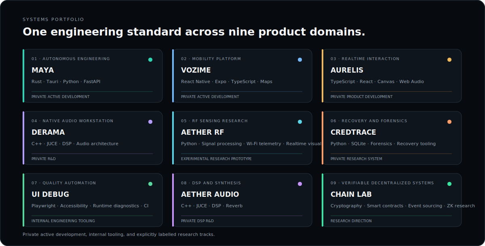
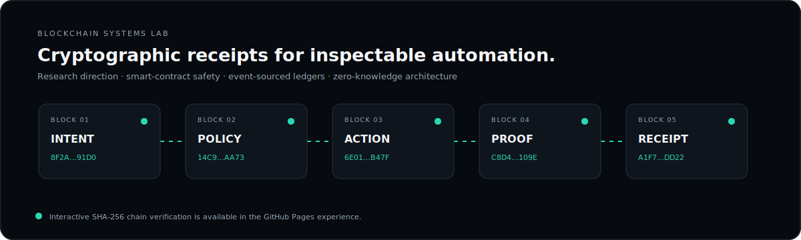
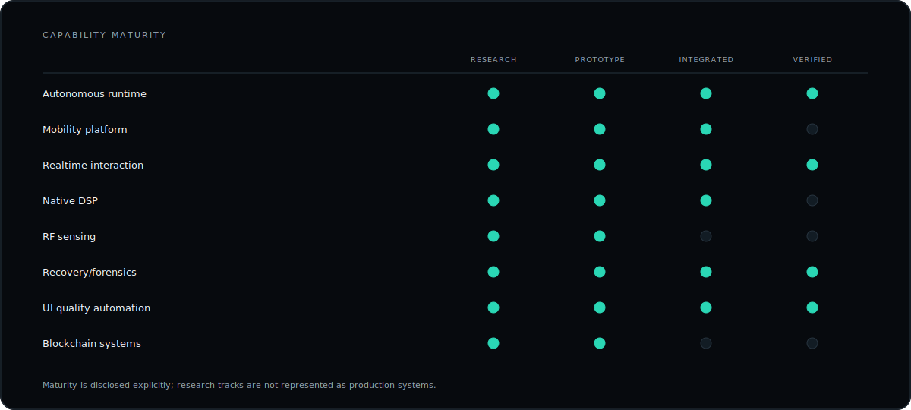

<picture>
  <source media="(prefers-color-scheme: dark)" srcset="./assets/generated/hero-dark.svg">
  <source media="(prefers-color-scheme: light)" srcset="./assets/generated/hero-light.svg">
  
</picture>

<strong>Autonomous AI · Mobility · Blockchain · Native DSP · RF research · Realtime product architecture</strong>

<a href="#maya-codex-nexus">MAYA</a> · <a href="#systems-portfolio">Systems</a> · <a href="#blockchain-systems-lab">Blockchain</a> · <a href="#engineering-activity">Activity</a> · <a href="https://gonzo-max2.github.io/gonzo-max2/">Interactive Profile OS</a>

## Operating profile

I design systems where **reasoning, execution, verification, and evidence remain one continuous object**.

Building proof-native autonomous systems, local-first AI infrastructure, mobility platforms, blockchain architecture, and instrument-grade products.

<table><tr><td width="50%" valign="top">

### Current mission

**MAYA Codex Nexus 6.6.1**

Rust control plane, verified autonomous execution, and model orchestration.

</td><td width="50%" valign="top">

### Delivery standard

- Runtime truth over simulated completion
- Typed contracts over implicit coupling
- Receipts over unsupported claims
- Graceful degradation over blank screens
- Measured performance over decorative motion
- Complete systems over disconnected prototypes

</td></tr></table>

## MAYA Codex Nexus

<picture><source media="(prefers-color-scheme: dark)" srcset="./assets/maya-system-dark.svg"><source media="(prefers-color-scheme: light)" srcset="./assets/maya-system-light.svg"></picture>

**MAYA Codex Nexus** is a local-first autonomous engineering workstation built around:

> Instruction → Observe → Frame → Decide → Act → Verify → Learn → Receipt

Its core invariant is simple: **a completion claim is not complete until its evidence is inspectable**.

## Systems portfolio

<picture><source media="(prefers-color-scheme: dark)" srcset="./assets/generated/systems-dark.svg"><source media="(prefers-color-scheme: light)" srcset="./assets/generated/systems-light.svg"></picture>

<table><tr>
<td width="50%" valign="top">

### MAYA Codex Nexus

Local-first autonomous engineering workstation with proof-native execution, specialist agents, transactional workspaces, model routing, and runtime receipts.

`Rust` `Tauri` `Python` `FastAPI` `React` `TypeScript` `SQLite` `Ollama`

**Status:** private active development

</td>
<td width="50%" valign="top">

### Vozime

Rider-and-driver mobile platform with role-aware navigation, trip lifecycle state, maps, realtime feedback, trusted notifications, and a premium mobile design system.

`React Native` `Expo` `TypeScript` `Maps` `Realtime state` `Mobile UX`

**Status:** private active development

</td>
</tr><tr>
<td width="50%" valign="top">

### AURELIS

Deterministic realtime presentation engine with velocity-driven motion, synchronized audio and haptics, pooled effects, responsive interaction, and runtime performance gates.

`TypeScript` `React` `Canvas` `Web Audio` `Realtime systems`

**Status:** private product development

</td>
<td width="50%" valign="top">

### DERAMA Studio

Professional audio-workstation architecture spanning playlist, channel rack, piano roll, mixer, automation, synthesis, sampling, editing, and native JUCE DSP.

`C++` `JUCE` `DSP` `Audio architecture` `Desktop UI`

**Status:** private R&D

</td>
</tr><tr>
<td width="50%" valign="top">

### AETHER RF Sense

Real-input-only Wi-Fi telemetry research exploring movement inference, resilient acquisition, operator-visible calibration, confidence, and realtime signal visualization.

`Python` `Signal processing` `Wi-Fi telemetry` `Realtime visualization`

**Status:** experimental research prototype

</td>
<td width="50%" valign="top">

### CredTrace Local Recovery Console

Bounded local recovery console with recursive scanning, browser-profile intelligence, archive inspection, resumable execution, redacted findings, and persistent evidence.

`Python` `SQLite` `Forensics` `Recovery tooling` `Local-first`

**Status:** private research system

</td>
</tr><tr>
<td width="50%" valign="top">

### UI_DEBUG_MCP_PRO

Fail-closed UI quality automation for browser exceptions, authentication failures, accessibility audits, runtime diagnostics, visual evidence, and CI receipts.

`Playwright` `Accessibility` `Runtime diagnostics` `CI` `Evidence receipts`

**Status:** internal engineering tooling

</td>
<td width="50%" valign="top">

### Aether Audio Lab

Native audio research spanning three-dimensional reverb, modulation, advanced synthesis, realtime visualization, and instrument-grade control surfaces.

`C++` `JUCE` `DSP` `Reverb` `Synthesis` `Realtime audio`

**Status:** private DSP R&D

</td>
</tr><tr>
<td width="50%" valign="top">

### Blockchain Systems Lab

Research track for cryptographic receipts, smart-contract safety, verifiable automation, event-sourced ledgers, zero-knowledge architecture, and disciplined on-chain/off-chain boundaries.

`Cryptography` `Smart contracts` `Event sourcing` `ZK research` `Rust`

**Status:** research direction

</td>
<td width="50%"></td>
</tr></table>

## Blockchain Systems Lab

<picture><source media="(prefers-color-scheme: dark)" srcset="./assets/generated/blockchain-dark.svg"><source media="(prefers-color-scheme: light)" srcset="./assets/generated/blockchain-light.svg"></picture>

The blockchain track is explicitly a **research direction**, focused on cryptographic execution receipts, event-sourced ledger integrity, smart-contract safety, verifiable autonomous actions, zero-knowledge proof architecture, and honest on-chain/off-chain boundaries.

The interactive Pages experience includes a local SHA-256 proof-chain demonstrator that detects tampering without a wallet, extension, or external blockchain service.

## Capability maturity

<picture><source media="(prefers-color-scheme: dark)" srcset="./assets/generated/capabilities-dark.svg"><source media="(prefers-color-scheme: light)" srcset="./assets/generated/capabilities-light.svg"></picture>

## Engineering activity

The panel below is generated from GitHub's API by this repository's own workflow.

<picture><source media="(prefers-color-scheme: dark)" srcset="./assets/activity-dark.svg"><source media="(prefers-color-scheme: light)" srcset="./assets/activity-light.svg"></picture>

## Collaboration model

- Autonomous developer tooling
- Secure local AI infrastructure
- Mobility and dispatch platforms
- Blockchain verification and cryptographic receipt systems
- Native desktop and audio software
- RF telemetry and scientific interfaces
- Recovery, evidence, and verification tooling
- High-performance, accessibility-complete interaction systems

<strong>Build locally. Verify everything. Ship with evidence.</strong>

