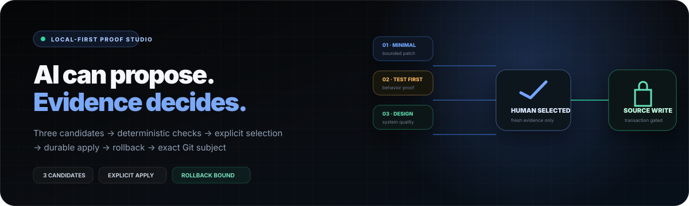
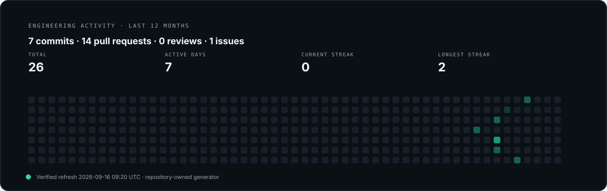

<picture>
  <source media="(prefers-color-scheme: dark)" srcset="./assets/apex/nova-dark.svg">
  <source media="(prefers-color-scheme: light)" srcset="./assets/apex/nova-light.svg">
  
</picture>

<p align="center">
  <strong>Verified AI change · Local-first developer tools · Deterministic evidence · Durable recovery</strong>
</p>

<p align="center">
  <a href="#nova-proof-studio">Nova</a>
  &nbsp;·&nbsp;
  <a href="#what-can-be-demonstrated-now">Evidence</a>
  &nbsp;·&nbsp;
  <a href="#known-boundaries">Boundaries</a>
  &nbsp;·&nbsp;
  <a href="#selected-related-work">Related work</a>
  &nbsp;·&nbsp;
  <a href="https://gonzo-max2.github.io/gonzo-max2/">Profile OS</a>
</p>


## Operating profile

I’m **Maya**, product owner and systems builder behind **Nova**.

I build local-first systems where model intent, source mutation, deterministic verification, and evidence remain one inspectable chain. My current focus is the uncomfortable gap between an AI saying that a code change works and a repository proving exactly what changed, against which revision, with which checks, and under whose authority.

Nova is a private technical asset. Repository access, the recorded demonstration, architecture, source package, and due-diligence evidence are available by invitation for serious licensing or acquisition review.

## Nova Proof Studio

**Nova is a local-first Proof Studio for turning bounded AI proposals into inspectable, reversible source changes.**

```text
prompt + revisioned context
        ↓
three candidate strategies
        ↓
exact patches + deterministic checks
        ↓
explicit human selection
        ↓
durable apply / rollback
        ↓
local Git commit + evidence
```

The product is deliberately stricter than a normal prompt-to-code demo. Models can propose. They cannot mark their own checks green, silently select a winner, or write directly to the working tree. The local agent retains source authority and binds candidate evidence to the repository revision it actually inspected.

<table>
<tr>
<td width="50%" valign="top">

### What it is

- A browser-based candidate and evidence workspace
- A local source-authority agent
- Provider-neutral routing for OpenAI, Anthropic, xAI, compatible endpoints, and local Ollama
- Three distinct candidate strategies per bounded run
- Deterministic checks for source scope, parsing, types, lint, tests, and preservation policy
- Explicit selection before mutation
- Durable transactions with rollback and restart hydration
- Local Git branch and commit evidence

</td>
<td width="50%" valign="top">

### What it is not

- Not a universal mouse-to-code engine
- Not a claim of compatibility with every framework, animation, or effect
- Not a deployed multi-tenant SaaS
- Not a live GitHub App or hosted admission service
- Not independently security-certified
- Not proven by customer revenue or a production fleet
- Not permission for a model to approve its own output
- Not a substitute for buyer-side technical diligence

</td>
</tr>
</table>

## What can be demonstrated now

The current local vertical slice is designed to show a complete causal chain rather than a collection of disconnected mock panels:

1. The Studio prepares context from real project files and the current repository revision.
2. A configured provider, including local Gemma through Ollama, produces three strategy-specific candidates.
3. Each candidate receives an exact patch, provenance, elapsed time, cost when reported, and truthful check states.
4. Nova rejects wrong-target or invalid changes instead of presenting them as successful.
5. A human explicitly selects a candidate.
6. The local agent revalidates the source baseline and applies through a durable transaction.
7. The transaction can roll back and can be hydrated after restart.
8. Local branch, commit, and evidence records preserve what was actually applied.

The implementation includes a responsive Proof Gallery, mobile review surfaces, keyboard operation, reduced-motion and forced-colors handling, persistent run records, signed local evidence, and a recorded buyer demonstration. Deterministic test fixtures remain in the test boundary; they are not described as live provider results.

For private review: **[request access to the Nova repository](https://github.com/gonzo-max2/NOVA)**. The repository is intentionally private, so the link only resolves for invited accounts.

## Known boundaries

The most commercially important unfinished work is also the most expensive:

- The cloud control plane, organization model, billing, and cross-tenant isolation are architecture, not a deployed service.
- Agent pairing over an outbound authenticated channel is not production-deployed.
- The GitHub App, draft-PR creation, remote Check Run, and exact-head merge admission are not live.
- Runtime screenshots are not yet synchronized into a universal visual-diff pipeline.
- Provider behavior, front-end frameworks, visual effects, and motion systems cannot be guaranteed universally.
- Real-provider canaries, external penetration testing, independent accessibility certification, and design-partner results are still required.

Those gaps are disclosed because Nova’s defensible value is the implemented local proof-and-transaction core, the product interaction model, and the architecture—not an unsupported claim that the full enterprise company already exists.

## Why this direction matters

Most AI coding products optimize proposal speed. Nova’s hypothesis is that high-consequence adoption depends on proving the subject and authority of a change:

- Which revision did the model see?
- Which files and ranges were allowed?
- What exact patch was evaluated?
- Which checks ran, and which did not?
- Who selected and approved it?
- Can the source be restored if the apply fails?
- Does later Git evidence still refer to the same immutable subject?

That creates a possible IP position around the integration of candidate generation, revision-bound context, deterministic eligibility, human authority, durable source transactions, and exact-subject admission. It is an implementation and product thesis, not a claim that no prior art exists.

## Selected related work

<table>
<tr>
<td width="50%" valign="top">

### [MAYA Codex Nexus](https://github.com/gonzo-max2/maya-codex-nexus)

A local-first, evidence-governed AI engineering workbench. It explores model orchestration, transactional workspaces, runtime receipts, recovery, and proof-native desktop interaction.

</td>
<td width="50%" valign="top">

### [Aegis Unified](https://github.com/gonzo-max2/aegis-unified-0.9.0)

Public repository for local AI runtime and interface work. Its local-model path informed Nova’s capability-aware Ollama and Gemma integration.

</td>
</tr>
</table>

The broader portfolio also contains mobility, realtime interaction, native DSP, RF sensing, recovery/forensics, UI-quality automation, and cryptographic-receipt research. These are supporting explorations, not substitutes for the Nova flagship.

## Engineering invariants

- Runtime truth over simulated completion
- Typed contracts over implicit coupling
- Receipts over unsupported claims
- Explicit authority over invisible automation
- Rollback before mutation
- Graceful degradation over fake availability
- Measured performance over decorative motion
- Research labelled honestly

## Engineering activity

The activity panel is generated by this repository’s GitHub Actions workflow using GitHub’s API. It does not depend on a third-party profile-stat renderer.

<picture>
  <source media="(prefers-color-scheme: dark)" srcset="./assets/activity-dark.svg">
  <source media="(prefers-color-scheme: light)" srcset="./assets/activity-light.svg">
  
</picture>

## Serious inquiries

For private technical diligence, licensing, or acquisition discussion, open a short non-confidential issue in this profile repository or use the repository-access channel already shared. Sensitive material should not be posted publicly.

<p align="center">
  <strong>AI can propose. Evidence decides.</strong>
</p>
